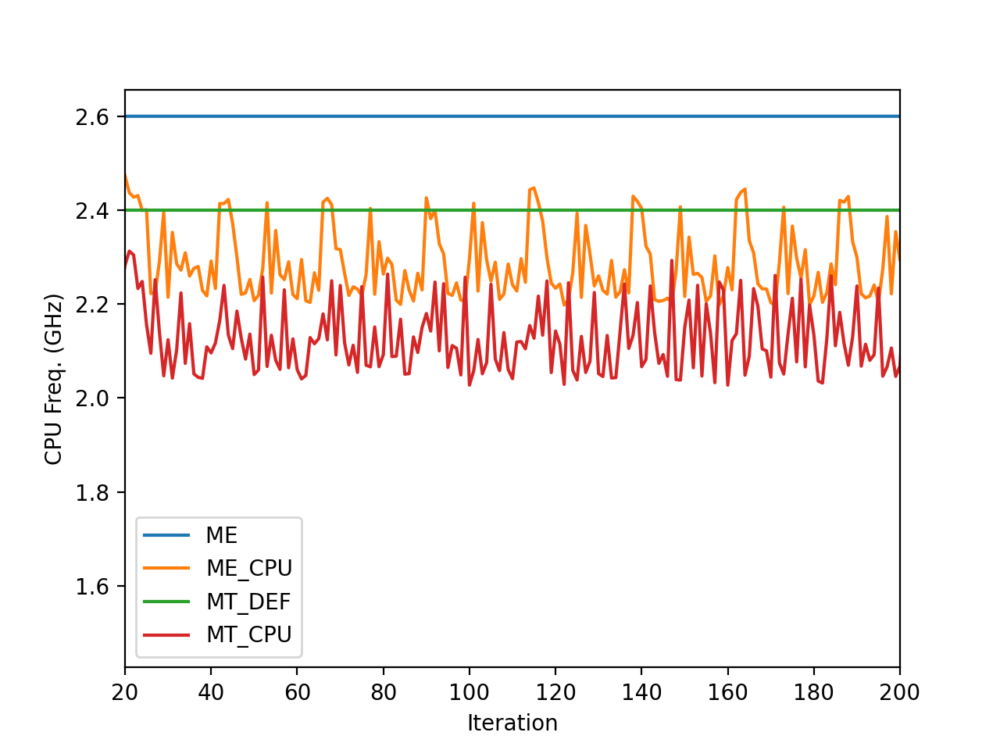
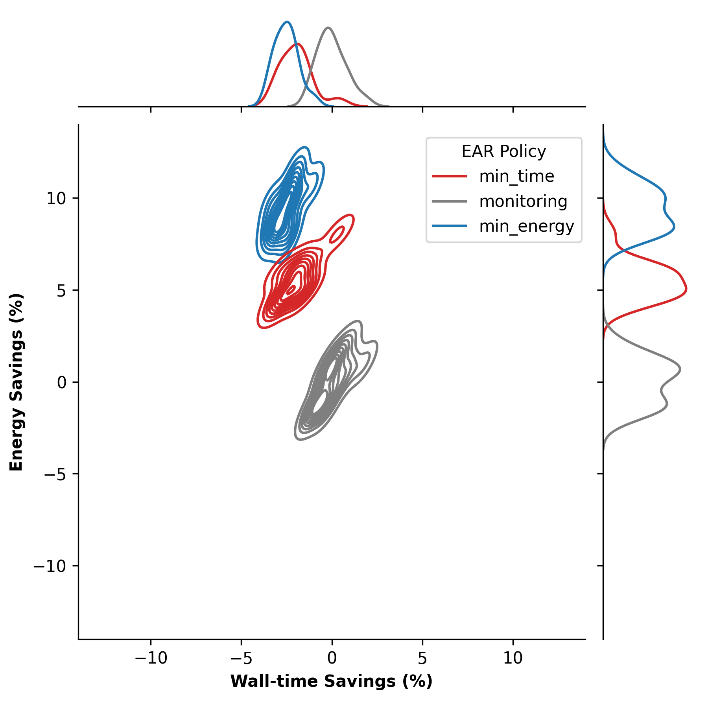

# Energy Aware Runtime (EAR) Tutorial

>EAR documentation for use on Snellius here: https://servicedesk.surf.nl/wiki/pages/viewpage.action?pageId=62226671
>
>EAR full documentation can be found here https://gitlab.bsc.es/ear_team/ear/-/wikis/home

## Section Outline

1. [Introduction](#introduction)
2. [EARL (the library)](#EARL)
3. [EAR Tools](#ear-tools)
4. [Excersizes](#excersizes)


<h2 id="introduction">Introduction</h2>

The Energy Aware Runtime (EAR) package provides an energy management framework for super computers. This tutorial covers the "end-user" experience with EAR.

EAR usage on Snellius can be decomposed into two "services." 

1. The EAR library (EARL): EARL is loaded (at runtime) when launching an application through the EAR Loader (EARLO) and SLURM plugin (EARPLUG). The EARL provides functionality to monitor energy (and performance) metrics of an application and additionally the ability to select the optimal CPU frequency according to the application and the node characteristics. 

2. Tools: Which include Job accounting (via the command eacct) which queries energy information of a particular job or list of jobs from the the EAR database (EAR DB) on Snellius.


### EARD: Node Manager
The node daemon is the component in charge of providing any kind of services that requires privileged capabilities. Current version is conceived as an external process executed with root privileges.
The EARD provides the following services, each one covered by one thread:

Provides privileged metrics to EARL such as the average frequency, uncore integrated memory controller counters to compute the memory bandwidth, as well as energy metrics (DC node, DRAM and package energy).
Implements a periodic power monitoring service. This service allows EAR package to control the total energy consumed in the system.
Offers a remote API used by EARplug, EARGM and EAR commands. This API accepts requests such as get the system status, change policy settings or notify new job/end job events.


<h2 id="EARL">EARL (the library)</h2>


The EAR Library is automatically loaded with MPI applications when EAR is enabled. EAR supports the utilization of both mpirun/mpiexec and srun commands.
To enable EAR in your job script when launching an MPI application you will need to include the following SBATCH options in your job script.

`srun` is the preferred job launcher when using EAR, as the EARL is a SLURM plugin! You will collect the largest amount of energy metrics when using srun
Running MPI applications with EARL is automatic for SLURM systems when using srun. All the jobs are monitored by EAR and the Library is loaded by default when EAR is enabled in the job script. To run a job with srun and EARL there is no need to load the EAR module. When using slurm commands for job submission, both Intel and OpenMPI implementations are supported. When using sbatch/srun or salloc to submit a job, Intel MPI and OpenMPI are supported.


### Example usage in a batch script

```
#SBATCH --ear=on
#SBATCH --ear-policy=monitoring
```

FULL example:
```bash
#!/bin/bash
 
#SBATCH -p rome
#SBATCH -t 00:30:00
#SBATCH --ntasks=128
 
#SBATCH --ear=on
#SBATCH --ear-policy=monitoring
#SBATCH --ear-verbose=1
 
module load 2022
module load foss/2022a
 
srun myapplication
```

### Application Characterization

EAR is not only a tool that will throttle CPU Freqs, but it also allows you to collect "traces" of your application, and characterize it. This is especially handy for large many node jobs, that often prove difficult to profile. In this way EAR is also a "light-weight" profiler for large applications.

The image below illustrates the usage of EAR to show the characteristics of a variety of multi-node CPU based applications side by side. This information can be obtained via the `monitoring` policy in EAR, and visualized with the `eacct` tool.


## EAR Policies

By understanding an application's characteristics we can try to "guess" at which Policy will be best suited for an application. 

EAR offers three energy policies plugins: min_energy, min_time and monitoring. The last one is not a power policy, is used just for application monitoring where CPU frequency is not modified (neither memory or GPU frequency).  For application analysis monitoringcan be used with specific CPU, memory and/or GPU frequencies.

The 2 optimization policies `min_time` and `min_energy` will tune the frequency for you. The energy policy is selected by setting the `--ear-policy=policy` option when submitting a SLURM job.

### min_energy 

The goal of this policy is to minimize the energy consumed with a limit to the performance degradation. 

This limit is set in the SLURM `--ear-policy-th` option or the configuration file. The `min_energy` policy will select the optimal frequency that minimizes energy enforcing (performance degradation <= parameter). When executing with this policy, applications starts at default frequency(specified at ear.conf).
```
PerfDegr = (CurrTime - PrevTime) / (PrevTime)
```

### min_time


The goal of this policy is to improve the execution time while guaranteeing a minimum ratio between performance benefit and frequency increment that justifies the increased energy consumption from this frequency increment. The policy uses the SLURM parameter option mentioned above as a minimum efficiency threshold.
Example: if `--ear-policy-th=0.75`, EAR will prevent scaling to upper frequencies if the ratio between performance gain and frequency gain do not improve at least `75% (PerfGain >= (FreqGain * threshold).`

```
PerfGain=(PrevTime-CurrTime)/PrevTime
FreqGain=(CurFreq-PrevFreq)/PrevFreq
```

When launched with min_time policy, applications start at a default frequency (defined at ear.conf).




In this image we see a 2D contour map of the Energy saving vs Time savings, which shows the Energy benefit and its associated performance loss for a 4 node run of the Lattice Boltzmann Method (LBM) CFD code Palabos (https://palabos.unige.ch).
Since LBM is a memory intensive algorithm, we see that the `min_energy` policy of EAR be most effective.




<h2 id="exercises">Exercise</h2>

1. What is the best policy to save energy for the NPB SP-MZ (class D) Run?
  - How much energy do you save? 
  - What is the performance degradation for using such a policy?
  - How does the size of the domain (simulation) change things? Does the "effectiveness" policy change?


